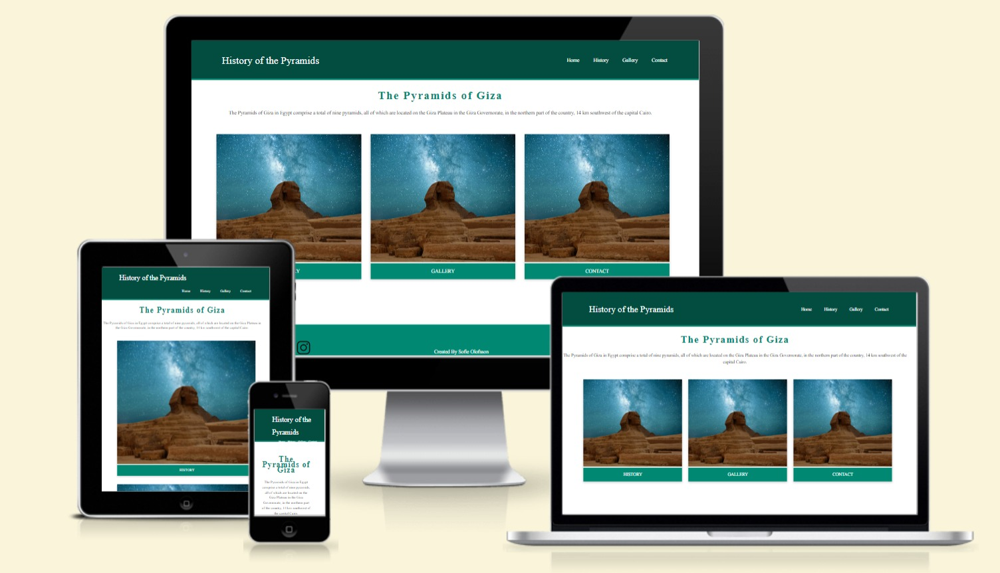
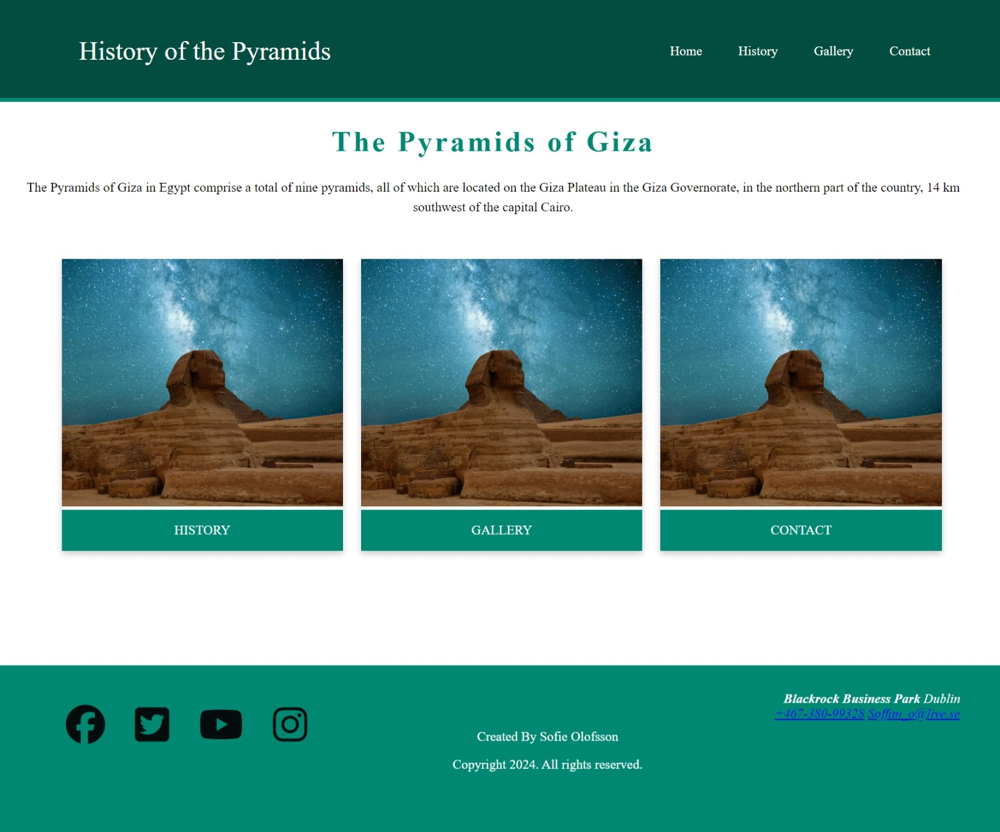
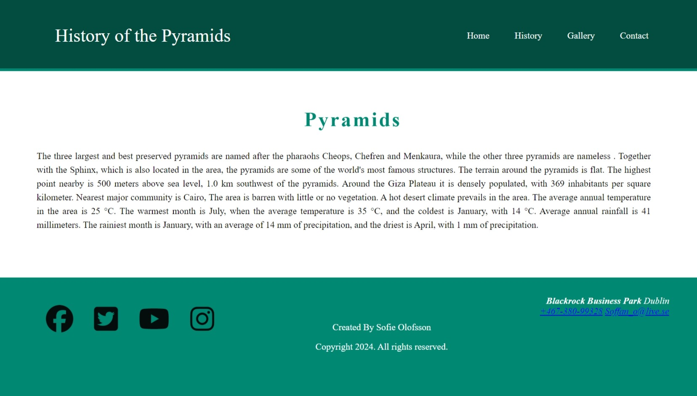
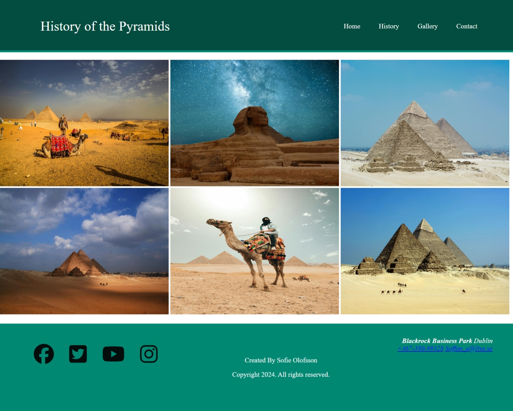
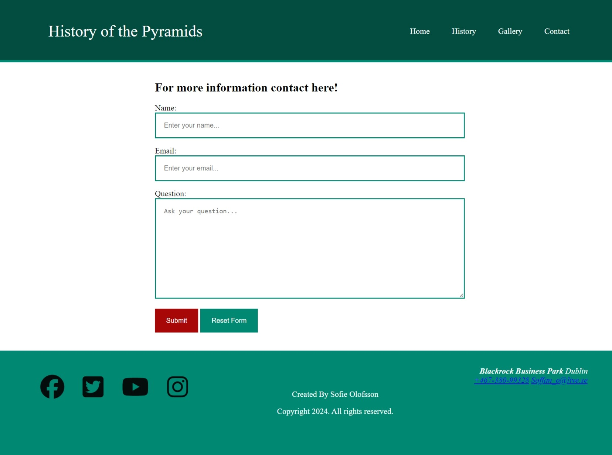
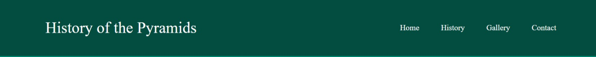
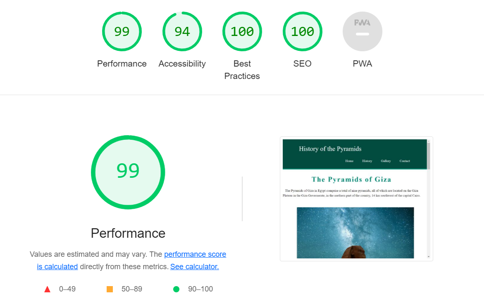

# Project-1

This is a website about the pyramids of Egypt

Link to the website https://sofski93.github.io/Portfolio-Project-1/index.html

## Content
---

* [Technologies used](https://github.com/Sofski93/Portfolio-Project-1/blob/main/README.md#technologies-used)
* [Pages and Features](https://github.com/Sofski93/Portfolio-Project-1/blob/main/README.md#pages-and-features)
* [Testing](https://github.com/Sofski93/Portfolio-Project-1/blob/main/README.md#testing)
* [Validator Testing](https://github.com/Sofski93/Portfolio-Project-1/blob/main/README.md#validator-testing)
* [Unfixed Bugs](https://github.com/Sofski93/Portfolio-Project-1/blob/main/README.md#unfixed-bugs)
* [Deployment](https://github.com/Sofski93/Portfolio-Project-1/blob/main/README.md#deployment)
* [Credits](https://github.com/Sofski93/Portfolio-Project-1/blob/main/README.md#credits)

## Technologies used
---

* HTML
* CSS

## Pages and Features
---

### Home

On the home page there is only some information about how many pyramids there are and where they are located.

### History

Contains the history of the pyramids in Egypt

### Gallery

Contains some pictures of the different pyramids in Egypt and Sphinx

### Contact

Contact form where you can fill in your name, email and a question

### Header & Navigation Bar

Same on every page, Home, History, Gallery and Contact.

### Footer

Fixed position, , social media to the left and a copyright in the middle, contacts to the right

## Testing
---
* I have tested that the website works well on Chrome, Safari, Edge.

* I have tested that you can go into the different tabs and everything is readable.

## Validator Testing
---

### Html

* No errors were returned when passing through the offcial W3C validator
### CSS

* No errors were found when passing through the offcial (Jigsaw) validator

### Accessibility

* I confirmed that the colors and front chosen are easy to read and accessible by running it through lighthouse in devtools

 

## Unfixed Bugs
---

* No unfixed bugs
  

## Deployment
---
* In your github repository, click the "settings" button in the navbar above your files.
* In the left-hand menu, select "pages".
* Under source, select which branch the webpage is being built from (main for me).
* Refresh the page and there will be a link to the website.

## Credits
---

### Content

* The code to make social media icons i took from https://docs.fontawesome.com/.

 ### Media

* The image in the home and gallery eas taken from https://www.pexels.com/ 

